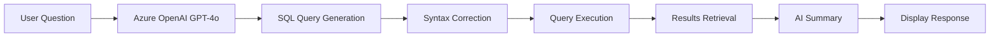

# 🏫 School Database Chatbot

> Powered by Azure OpenAI GPT-4o

## 📋 Table of Contents

- [Project Overview](#project-overview)
- [Features](#features)
- [Technology Stack](#technology-stack)
- [Project Structure](#project-structure)
- [Installation Guide](#installation-guide)
- [Usage Guide](#usage-guide)
- [How It Works](#how-it-works)
- [Database Schema](#database-schema)
- [Troubleshooting](#troubleshooting)
- [Configuration Options](#configuration-options)
- [Security Considerations](#security-considerations)
- [Extending the Application](#extending-the-application)
- [Sample Queries](#sample-queries)
- [FAQ](#faq)
- [Support & Resources](#support--resources)

---

## 🎯 Project Overview

This is an intelligent chatbot application that allows users to query a school database using natural language. The application converts user questions into SQL queries, executes them against a SQL Server database, and returns results in a conversational format.

---

## ✨ Features

- ✅ **Azure OpenAI GPT-4o Integration** - Advanced natural language processing
- ✅ **SQL Server Database** - 9 comprehensive tables with school data
- ✅ **Automatic SQL Syntax Correction** - Converts LIMIT → TOP for SQL Server
- ✅ **Streamlit Web Interface** - Beautiful browser-based chat interface
- ✅ **Real-time Query Execution** - Instant results from database
- ✅ **Natural Language Responses** - AI-generated conversational summaries

### 🌐 Streamlit Web UI

When using Streamlit, you'll get a browser-based chat interface with:
- Interactive text input for natural language questions
- Generated SQL query display
- Results displayed in formatted tables
- Natural language summaries of results

#### 💡 Streamlit Tips

**Session State & Caching:**
- Store conversation history in `st.session_state` for persistent interactions
- Cache expensive operations (AI calls, DB queries) with `st.cache_data` / `st.cache_resource`
- Example patterns:
  - Cache database connections: `st.cache_resource`
  - Cache query results: `st.cache_data(key=...)`

> ⚠️ **Security Note:** Never cache sensitive credentials or API keys. Keep secrets in environment variables or Streamlit secrets manager.

---

## 🛠️ Technology Stack

| Technology | Purpose |
|------------|---------|
| Azure OpenAI API (GPT-4o) | Natural language processing |
| SQL Server | Database management |
| Python 3.8+ | Application logic |
| Streamlit | Web interface |
| pyodbc | Database connectivity |

---

## 📁 Project Structure

```plaintext
school-analytic-bot-streamlit/
│
├── app.py                 # Main application file
├── config.py              # Configuration management
├── requirements.txt       # Python dependencies
├── .env                   # Environment variables (create this)
├── school_db.sql         # Database creation script
└── README.md             # This file
```

---

## 📥 Installation Guide

### Step 1: Prerequisites

Before you begin, ensure you have:

- ✅ Python 3.8 or higher installed
- ✅ Microsoft SQL Server installed and running
- ✅ SQL Server ODBC Driver 17 installed
- ✅ Azure OpenAI API access with valid credentials
- ✅ pip (Python package manager)

### Step 2: Download Project Files

Download all project files to a directory, for example:

```plaintext
C:\Projects\school-chatbot\
```

### Step 3: Install Python Dependencies

Open Command Prompt or Terminal in the project directory and run:

```bash
pip install -r requirements.txt
```

This will install:
- `openai>=1.12.0` - Azure OpenAI client
- `pyodbc>=5.0.1` - Database connectivity
- `python-dotenv>=1.0.0` - Environment variable management
- `streamlit` - Web UI (optional)

### Step 4: Configure Environment Variables

Create a file named `.env` in the project root directory with the following content:

```env
# Azure OpenAI Configuration
AZURE_OPENAI_API_KEY=your_azure_openai_api_key_here
AZURE_OPENAI_ENDPOINT=https://ai-proxy.lab.epam.com
AZURE_OPENAI_API_VERSION=2025-04-01-preview
AZURE_OPENAI_DEPLOYMENT=gpt-4o

# Database Configuration
DB_SERVER=localhost
DB_NAME=SchoolDB
DB_USERNAME=sa
DB_PASSWORD=your_password
```

> ⚠️ **IMPORTANT:** Replace the placeholder values with your actual credentials!

### Step 5: Create Database

1. Open **SQL Server Management Studio (SSMS)**
2. Connect to your SQL Server instance
3. Open the `school_db.sql` file
4. Execute the script (F5 or click Execute)
5. Verify that the SchoolDB database is created with sample data

### Step 6: Run the Application

In the project directory, run:

#### Option A - Console Application (original behavior):

```bash
python app.py
```

#### Option B - Streamlit Web UI (recommended):

```bash
streamlit run app.py
```

If you use Streamlit, you'll get a browser-based chat interface that automatically opens at `http://localhost:8501`.

---

## 🚀 Usage Guide

### Starting the Chatbot

**Console Mode:**
```bash
python app.py
```

**Web UI Mode:**
```bash
streamlit run app.py
```

The chatbot will display connection information and wait for your input.

### Asking Questions

Simply type your question in natural language. Here are some examples:

#### 👨‍🎓 Student Queries

- "How many students are studying at school?"
- "Show me all students in grade 9"
- "Who is the best student?"
- "List top 5 students by average score"

#### 👨‍🏫 Teacher Queries

- "List all teachers"
- "Show me teachers in the Mathematics department"
- "Who teaches Biology?"

#### 📊 Grades & Scores

- "What is John Adams' math score?"
- "Show me all scores for Emily Johnson"
- "What are the average scores by subject?"
- "The most successful student"

#### 📚 Library Queries

- "What books has John Adams checked out?"
- "Show me all available books"
- "Which books are currently checked out?"

#### 📅 Attendance

- "Show John Adams' attendance record"
- "How many days was Michael Brown absent?"

#### 💬 General Questions

- "What can you do?"
- "Help"
- "Hello"

### Exiting the Chatbot

Type any of these commands:
- `quit`
- `exit`
- `bye`

Or press **Ctrl+C**

---

## ⚙️ How It Works

### Workflow



1. **User Input** - User enters a question in natural language
2. **AI Processing** - Question is sent to Azure OpenAI GPT-4o
3. **SQL Generation** - AI converts the question to a SQL query
4. **Syntax Correction** - SQL syntax is automatically corrected for SQL Server
5. **Execution** - Query is executed against the database
6. **Results** - Results are retrieved and formatted
7. **Summary** - AI generates a natural language summary
8. **Response** - Response is displayed to the user

### Key Functions

| Function | Purpose |
|----------|---------|
| `query_db(query)` | Executes SQL query and returns results |
| `get_sql_query_from_ai()` | Converts natural language to SQL |
| `fix_sql_syntax()` | Corrects SQL syntax for SQL Server |
| `get_ai_summary()` | Generates natural language response |
| `main()` | Main chatbot loop |

---

## 🗄️ Database Schema

### Tables Overview

| Table | Description |
|-------|-------------|
| **Students** | Student information and enrollment |
| **Teachers** | Teacher information and departments |
| **Subjects** | Course subjects and descriptions |
| **Classes** | Class schedules and assignments |
| **ClassEnrollments** | Student-class relationships |
| **Scores** | Student grades by quarter |
| **Attendance** | Daily attendance records |
| **Books** | Library book inventory |
| **LibraryCheckouts** | Book checkout history |

### Sample Data

- 📚 **8 Students** (grades 7-11)
- 👨‍🏫 **4 Teachers** (Math, English, Science, History)
- 📖 **5 Subjects**
- 🏛️ **5 Classes** (Fall 2024 semester)
- 📊 Multiple scores, attendance records, and library checkouts

---

## 🔧 Troubleshooting

### Problem: "Cannot connect to database"

**Solution:**
- ✅ Verify SQL Server is running
- ✅ Check `DB_SERVER`, `DB_USERNAME`, `DB_PASSWORD` in `.env`
- ✅ Ensure SQL Server allows SQL authentication
- ✅ Test connection using SSMS

### Problem: "Azure OpenAI API error"

**Solution:**
- ✅ Verify `AZURE_OPENAI_API_KEY` is correct
- ✅ Check endpoint URL is accessible
- ✅ Ensure you have API quota available
- ✅ Verify deployment name is correct (`gpt-4o`)

### Problem: "Incorrect syntax near 'LIMIT'"

**Solution:**
- ✅ This should be automatically fixed by `fix_sql_syntax()`
- ✅ If persists, update the `SYSTEM_PROMPT` to emphasize SQL Server syntax
- ✅ Manually check the generated query

### Problem: "Object of type Decimal is not JSON serializable"

**Solution:**
- ✅ This is fixed in `query_db()` function
- ✅ Ensure you're using the latest version of `app.py`
- ✅ Decimal values are automatically converted to float

### Problem: "Module not found" errors

**Solution:**
```bash
pip install -r requirements.txt
```
- ✅ Ensure you're in the correct directory
- ✅ Check Python version (3.8+)

### Problem: Slow responses

**Solution:**
- ✅ Azure OpenAI might be rate-limited
- ✅ Check your internet connection
- ✅ Verify API endpoint is responsive
- ✅ Consider reducing temperature parameter

---

## ⚙️ Configuration Options

### Azure OpenAI Settings (config.py)

```python
AZURE_OPENAI_API_KEY       # Your API key
AZURE_OPENAI_ENDPOINT      # API endpoint URL
AZURE_OPENAI_API_VERSION   # API version
AZURE_OPENAI_DEPLOYMENT    # Model deployment name
```

### Database Settings (config.py)

```python
DB_SERVER                  # SQL Server hostname/IP
DB_NAME                    # Database name (SchoolDB)
DB_USERNAME                # SQL Server username
DB_PASSWORD                # SQL Server password
DB_DRIVER                  # ODBC driver name
```

### AI Behavior (app.py)

| Parameter | Value | Purpose |
|-----------|-------|---------|
| `temperature` | 0 | SQL generation (deterministic) |
| `temperature` | 0.7 | Summaries (creative) |
| `SYSTEM_PROMPT` | - | Instructions for AI behavior |
| `DATABASE_SCHEMA` | - | Schema information for AI |

---

## 🔒 Security Considerations

### Important Security Notes

1. ⚠️ **NEVER** commit `.env` file to version control
2. 🔐 Use strong passwords for database access
3. 🛡️ Restrict database user permissions (SELECT only recommended)
4. 🔑 Keep Azure OpenAI API key confidential
5. 📦 Use environment variables for all sensitive data
6. ⏱️ Consider implementing rate limiting for production use
7. ✅ Validate and sanitize all user inputs
8. 🔒 Use parameterized queries (already implemented)

### Best Practices

- 🔄 Regularly rotate API keys
- 🎯 Use separate credentials for development/production
- 📊 Monitor API usage and costs
- 📝 Implement logging for audit trails
- 💾 Regular database backups
- ⬆️ Keep dependencies updated

---

## 🚀 Extending the Application

### Optional Enhancements

#### 1. 🌐 Web Interface
- Add Flask or FastAPI
- Create HTML/CSS frontend
- Deploy to cloud (Azure, AWS, etc.)

#### 2. 📝 Query History
- Save conversation logs
- Implement session management
- Add query analytics

#### 3. 📤 Export Functionality
- Export results to CSV
- Generate PDF reports
- Excel integration

#### 4. 📊 Visualization
- Add charts for grades
- Attendance graphs
- Performance dashboards

#### 5. 🔐 Authentication
- User login system
- Role-based access control
- Student/Teacher/Admin roles

#### 6. 🎯 Advanced Features
- Voice input (speech-to-text)
- Multi-language support
- Email notifications
- Scheduled reports

### Adding New Tables

1. Create table in SQL Server
2. Update `DATABASE_SCHEMA` in `app.py`
3. Add example queries to `SYSTEM_PROMPT`
4. Test with various questions

### Modifying AI Behavior

Edit `SYSTEM_PROMPT` in `app.py` to:
- Add new query patterns
- Change response style
- Add domain-specific rules
- Improve query accuracy

---

## 📊 Sample Queries

### Query: "How many students are studying at school?"

**Generated SQL:**
```sql
SELECT COUNT(*) AS TotalStudents 
FROM Students 
WHERE IsActive = 1;
```
**Result:** 8 students

---

### Query: "Who is the best student?"

**Generated SQL:**
```sql
SELECT TOP 1 
    s.FirstName + ' ' + s.LastName AS StudentName, 
    AVG(sc.Score) AS AverageScore 
FROM Scores sc 
JOIN Students s ON sc.StudentID = s.StudentID 
WHERE s.IsActive = 1 
GROUP BY s.StudentID, s.FirstName, s.LastName 
ORDER BY AverageScore DESC;
```
**Result:** Emily Johnson with average score 93.17

---

### Query: "What books has John Adams checked out?"

**Generated SQL:**
```sql
SELECT b.Title, b.Author, lc.CheckoutDate, lc.Status 
FROM LibraryCheckouts lc 
JOIN Books b ON lc.BookID = b.BookID 
JOIN Students s ON lc.StudentID = s.StudentID 
WHERE s.FirstName = 'John' AND s.LastName = 'Adams';
```
**Result:** 3 books (To Kill a Mockingbird, The Hunger Games, Harry Potter)

---

### Query: "List all teachers in Mathematics department"

**Generated SQL:**
```sql
SELECT FirstName + ' ' + LastName AS TeacherName, Email, HireDate 
FROM Teachers 
WHERE Department = 'Mathematics' AND IsActive = 1;
```
**Result:** Robert Thompson

---

## ❓ FAQ

### Q: Can I use a different database (MySQL, PostgreSQL)?

**A:** Yes, but you'll need to modify the connection string and SQL syntax in `query_db()` and `fix_sql_syntax()` functions.

### Q: Can I use regular OpenAI instead of Azure OpenAI?

**A:** Yes, change the import to `from openai import OpenAI` and update the client initialization in `app.py`.

### Q: How much does it cost to run?

**A:** Costs depend on Azure OpenAI usage. Each query makes 2 API calls (one for SQL generation, one for summary). Monitor your usage.

### Q: Can multiple users use this simultaneously?

**A:** The current version is single-user. For multi-user, implement a web server with session management.

### Q: How accurate are the SQL queries?

**A:** Accuracy depends on question clarity and AI training. The system includes examples and schema information to improve accuracy.

### Q: Can I add more sample data?

**A:** Yes, add INSERT statements to `school_db.sql` or use SSMS to manually insert data.

### Q: Is this production-ready?

**A:** This is a solid foundation but consider adding:
- Authentication
- Rate limiting
- Comprehensive logging
- Error monitoring
- Load balancing (for web version)

### Q: Can I modify the database schema?

**A:** Yes, but update `DATABASE_SCHEMA` in `app.py` to match your changes.

---

## 📚 Support & Resources

### Documentation

- [Azure OpenAI](https://learn.microsoft.com/en-us/azure/ai-services/openai/)
- [pyodbc](https://github.com/mkleehammer/pyodbc)
- [SQL Server](https://docs.microsoft.com/en-us/sql/)
- [Streamlit](https://docs.streamlit.io/)

### Common Resources

- [Python Documentation](https://docs.python.org/3/)
- [SQL Server Management Studio](https://docs.microsoft.com/en-us/sql/ssms/)
- [ODBC Driver](https://docs.microsoft.com/en-us/sql/connect/odbc/)

### Getting Help

For issues with:
- **Azure OpenAI:** Check Azure portal and documentation
- **SQL Server:** Verify connection and permissions
- **Python:** Check error messages and stack traces

---

## 📝 Version History

### Version 1.0.0 (Current)

- ✅ Initial release
- ✅ Azure OpenAI integration
- ✅ SQL Server database support
- ✅ Natural language query processing
- ✅ Automatic SQL syntax correction
- ✅ Decimal type handling
- ✅ Conversational responses
- ✅ Error handling and recovery
- ✅ Streamlit web interface

---

## 📜 Credits & License

This project demonstrates integration of:
- **Azure OpenAI API** for natural language processing
- **SQL Server** for data storage
- **Python** for application logic
- **Streamlit** for web interface

Feel free to modify and extend this application for your needs.

---

<div align="center">

**Made with ❤️ using Azure OpenAI and Python**

For questions or issues, please review the [Troubleshooting](#troubleshooting) section above.

</div>
